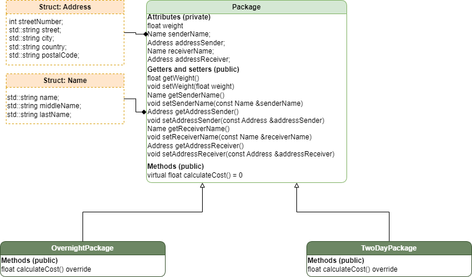

# Assignmnet 4.2

## UML Diagram


## Useful commands
### Compile
```bash
g++ -o program src/obj/Package.cpp src/obj/OverNightPackage.cpp src/obj/TwoDayPackage.cpp src/console/printFunctions.cpp src/main.cpp
```

### Run
```bash
./program.exe
```

